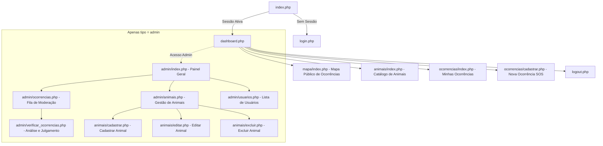
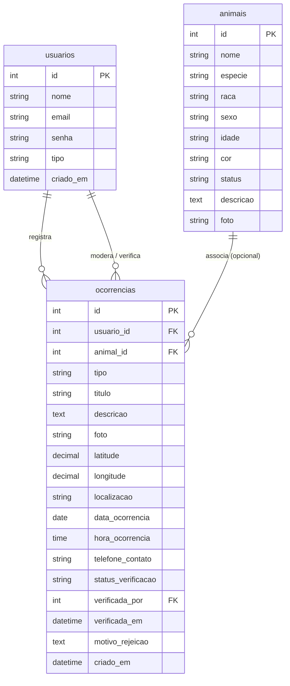
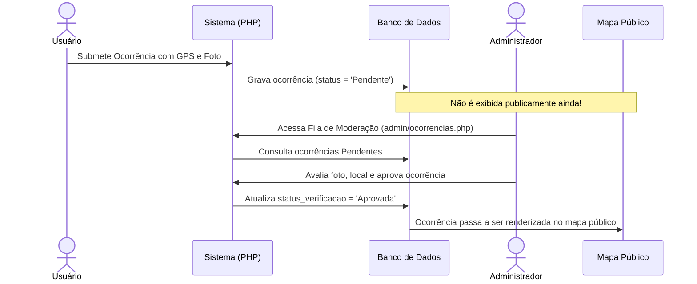

# Especificação Técnica e Funcional do Sistema (Software Specification Document)
## Projeto: Minha Patinha — Gestão de Animais e Ocorrências SOS

---

## 1. Visão Geral do Sistema

### 1.1 Identificação do Projeto
* **Nome do Sistema:** Minha Patinha
* **Finalidade:** Plataforma web integrada para cadastro e acompanhamento de animais domésticos, registro georreferenciado de animais perdidos e encontrados (SOS) com fluxo de moderação administrativa, e catálogo para adoção responsável.
* **Localização Base:** Porto Velho - Rondônia (configuração padrão no mapa: `lat: -8.7619, lng: -63.9039`).
* **Stack Tecnológica:**
  * **Backend:** PHP 8+ (padrão procedimental modularizado com PDO)
  * **Banco de Dados:** MySQL / MariaDB (Driver PDO UTF-8)
  * **Frontend:** HTML5 semântico, CSS3 (variáveis customizadas, design responsivo com Grid e Flexbox), JavaScript nativo (ES6+)
  * **Bibliotecas Externas:** [Leaflet.js v1.9.4](https://leafletjs.com/) e mapas vetoriais [OpenStreetMap](https://www.openstreetmap.org/)
  * **Servidor Local:** Apache (XAMPP para Windows)

---

## 2. Atores e Perfis de Acesso (RBAC)

O sistema opera com controle de sessão baseado em níveis de autorização:

| Ator / Papel | Nível de Autenticação | Permissões no Sistema |
| :--- | :--- | :--- |
| **Visitante / Público** | Não autenticado | Visualiza a tela inicial/redirecionamento de login; no fluxo atual, o acesso aos módulos requer autenticação. |
| **Usuário Registrado** (`usuario`) | Autenticado (`usuario_id`, `tipo = 'usuario'`) | Acesso ao Dashboard geral, visualização da listagem de animais públicos, registro de novas ocorrências SOS com foto e coordenadas no mapa, listagem e detalhamento das suas próprias ocorrências. |
| **Administrador** (`admin`) | Autenticado (`usuario_id`, `tipo = 'admin'`) | Todas as permissões de usuário comum, mais: Painel Administrativo (`/admin`), aprovação e rejeição de ocorrências com justificativa, CRUD completo de animais (cadastro, edição, exclusão e alteração de status) e consulta da base de usuários. |

---

## 3. Arquitetura de Navegação e Mapa de Telas

---

## 4. Dicionário de Dados e Modelo Relacional

O banco de dados relacional `gestao_animais` é composto por 3 entidades principais:

### 4.1 Tabela `usuarios`
Armazena as credenciais e dados dos usuários do sistema.

| Coluna | Tipo | Nulo | Padrão | Descrição |
| :--- | :--- | :--- | :--- | :--- |
| `id` | INT AUTO_INCREMENT | Não | - | Identificador único (Chave Primária) |
| `nome` | VARCHAR(150) | Não | - | Nome completo do usuário |
| `email` | VARCHAR(150) | Não | - | E-mail corporativo ou pessoal (Único) |
| `senha` | VARCHAR(255) | Não | - | Hash criptográfico gerado via `password_hash()` |
| `tipo` | ENUM('admin', 'usuario') | Não | `'usuario'` | Papel de privilégio do usuário |
| `criado_em` | DATETIME | Sim | `CURRENT_TIMESTAMP` | Data/hora de criação do cadastro |

### 4.2 Tabela `animais`
Centraliza as fichas dos animais cadastrados na base do abrigo/organização.

| Coluna | Tipo | Nulo | Padrão | Descrição |
| :--- | :--- | :--- | :--- | :--- |
| `id` | INT AUTO_INCREMENT | Não | - | Chave Primária |
| `nome` | VARCHAR(100) | Não | - | Nome do animal |
| `especie` | VARCHAR(50) | Não | - | Espécie (`Cachorro`, `Gato`, `Outro`) |
| `raca` | VARCHAR(80) | Sim | NULL | Raça identificada ou estimada |
| `sexo` | ENUM('Macho', 'Fêmea')| Não | - | Gênero biológico do animal |
| `idade` | VARCHAR(50) | Sim | NULL | Faixa etária ou idade textual (ex: "2 anos", "Filhote") |
| `cor` | VARCHAR(50) | Sim | NULL | Cor predominante da pelagem |
| `status` | VARCHAR(50) | Não | `'Cadastrado'`| `Cadastrado`, `Perdido`, `Encontrado`, `Disponível para adoção`, `Adotado` |
| `descricao` | TEXT | Sim | NULL | Características comportamentais e físicas |
| `foto` | VARCHAR(255) | Sim | NULL | Nome do arquivo salvo em `/uploads/animais/` |

### 4.3 Tabela `ocorrencias`
Registros georreferenciados de chamados SOS e alertas de animais na rua.

| Coluna | Tipo | Nulo | Padrão | Descrição |
| :--- | :--- | :--- | :--- | :--- |
| `id` | INT AUTO_INCREMENT | Não | - | Chave Primária |
| `usuario_id` | INT | Não | - | FK referenciando `usuarios.id` (autor) |
| `animal_id` | INT | Sim | NULL | FK referenciando `animais.id` (vínculo opcional) |
| `tipo` | ENUM('Perdido', 'Encontrado') | Não | - | Classificação da ocorrência |
| `titulo` | VARCHAR(200) | Não | - | Resumo do alerta |
| `descricao` | TEXT | Não | - | Detalhes, ponto de referência e condições |
| `foto` | VARCHAR(255) | Não | - | Arquivo em `/uploads/ocorrencias/` |
| `latitude` | DECIMAL(10, 8) | Não | - | Coordenada geográfica (latitude) |
| `longitude` | DECIMAL(11, 8) | Não | - | Coordenada geográfica (longitude) |
| `localizacao` | VARCHAR(255) | Não | - | Texto ou coordenadas legíveis do ponto |
| `data_ocorrencia`| DATE | Não | - | Data em que o animal foi visto/perdido |
| `hora_ocorrencia`| TIME | Sim | NULL | Horário aproximado do evento |
| `telefone_contato`| VARCHAR(30) | Sim | NULL | Telefone com DDD para contato imediato |
| `status_verificacao`| ENUM('Pendente', 'Aprovada', 'Rejeitada') | Não | `'Pendente'` | Estado da moderação de conteúdo |
| `verificada_por` | INT | Sim | NULL | FK referenciando `usuarios.id` (moderador) |
| `verificada_em` | DATETIME | Sim | NULL | Timestamp de análise da ocorrência |
| `motivo_rejeicao` | TEXT | Sim | NULL | Justificativa em caso de recusa |
| `criado_em` | DATETIME | Sim | `CURRENT_TIMESTAMP` | Data de inclusão da ocorrência no banco |

---

## 5. Módulos Funcionais e Regras de Negócio

### 5.1 Módulo de Autenticação e Segurança
* **Login (`login.php`):** Autenticação por e-mail e validação de hash (`password_verify`).
* **Sessão:** Inicializa `$_SESSION["usuario_id"]`, `$_SESSION["usuario_nome"]` e `$_SESSION["usuario_tipo"]`.
* **Guardas de Rota (`config/auth.php`):**
  * `verificarLogin()`: Redireciona usuários anônimos para o login.
  * `verificarAdmin()`: Bloqueia usuários comuns e restringe recursos apenas para `tipo === 'admin'`.

### 5.2 Módulo de Ocorrências SOS (Alerta e Resgate)
* **Cadastro de Ocorrência (`ocorrencias/cadastrar.php`):**
  * Captura interativa de coordenadas através de mapa Leaflet: o usuário clica sobre a área exata onde o animal está, e os campos `latitude`, `longitude` e `localizacao` são preenchidos automaticamente.
  * Upload obrigatório de foto do animal (formatos validados: JPG, JPEG, PNG, WEBP).
  * Toda nova ocorrência é gravada com `status_verificacao = 'Pendente'`.

### 5.3 Módulo de Moderação Administrativa
* **Fila de Verificação (`admin/ocorrencias.php`):** Ocorrências pendentes são ordenadas no topo da fila de atendimento.
* **Julgamento de Ocorrência (`admin/verificar_ocorrencias.php`):**
  * **Aprovação:** Marca a ocorrência como `'Aprovada'`, salva o ID do admin e data/hora. Caso haja um `animal_id` associado, atualiza o status do animal sincronizado (`Perdido` ou `Encontrado`).
  * **Rejeição:** Exige preenchimento obrigatório do campo `motivo_rejeicao` e altera status para `'Rejeitada'`.

### 5.4 Módulo de Mapa Interativo Público (`mapa/index.php`)
* Executa consulta direta filtrada: `WHERE o.status_verificacao = 'Aprovada'`.
* Converte os registros em payload JSON nativo injetado no JavaScript do Leaflet.
* Exibição com CircleMarkers diferenciados por cor:
  * 🔴 **Vermelho:** Animal Perdido
  * 🔵 **Azul:** Animal Encontrado
* Popup customizado com imagem do animal, título, descrição, endereço, data e badge visual de verificação.

### 5.5 Módulo de Gestão de Animais (`animais/` e `admin/animais.php`)
* Cadastro completo de animais com foto individual (armazenada em `/uploads/animais/`).
* Filtros de status no Dashboard: contadores dinâmicos para `Total`, `Perdido`, `Encontrado` e `Disponível para Adoção`.
* Edição de fichas e exclusão com janela de confirmação no front-end (`assets/js/script.js`).

---

## 6. Auditoria Técnica e Diagnóstico de Inconsistências

Durante a análise estática detalhada do código-fonte, foram identificadas as seguintes correções necessárias e pontos de melhoria:

> [!WARNING]
> **1. Discrepância na Variável de Sessão de Administrador**
> * No arquivo `login.php` (linha 26): `$_SESSION["usuario_tipo"] = $usuario["tipo"];`
> * No arquivo `dashboard.php` (linha 60): `if (isset($_SESSION["tipo"]) && $_SESSION["tipo"] === "admin")`
> * **Efeito colateral:** O botão de atalho para o "Painel Admin" não é exibido no topo do Dashboard, pois a chave da sessão está divergente (`usuario_tipo` vs `tipo`).

> [!WARNING]
> **2. Link Quebrado (Erro 404) na Tabela de Ocorrências do Admin**
> * No arquivo `admin/ocorrencias.php` (linha 223): `<a href="verificar_ocorrencia.php?id=...">`
> * No sistema de arquivos, o script real chama-se `verificar_ocorrencias.php` (no plural).
> * **Efeito colateral:** Ao clicar em "Analisar", o navegador resulta em erro HTTP 404.

> [!NOTE]
> **3. Arquivos Stub Vazios (0 Bytes)**
> Foram detectados arquivos sem conteúdo criados na estrutura:
> * `admin/cadastrar.php`
> * `admin/editar.php`
> * `admin/excluir.php`
> * `admin/visualizar.php`
> * `mapa/mapa.php`
> * **Recomendação:** Como a pasta `animais/` já possui os arquivos `cadastrar.php`, `editar.php`, `excluir.php` e `visualizar.php`, esses arquivos em branco em `/admin/` podem ser removidos ou reaproveitados com redirecionamento para evitar confusão na manutenção.

---

## 7. Requisitos Não-Funcionais (RNF)

| Identificador | Categoria | Descrição |
| :--- | :--- | :--- |
| **RNF-01** | **Segurança** | Criptografia obrigatória de senhas com algoritmo Bcrypt através de `password_hash()` e `password_verify()`. |
| **RNF-02** | **Proteção contra Injeção** | 100% das consultas dinâmicas devem continuar utilizando Prepared Statements PDO com binding de parâmetros. |
| **RNF-03** | **Validação de Uploads** | Limitação de tamanho de imagem a no máximo 5MB (validado tanto via JS no `script.js` quanto no backend PHP) e whitelist estrita de extensões permitidas (`jpg`, `jpeg`, `png`, `webp`). |
| **RNF-04** | **Usabilidade Mobile** | Formulário de ocorrências com controles táteis e mapa Leaflet com suporte a pinch-to-zoom e clique responsivo para uso direto de smartphones em campo. |
| **RNF-05** | **Integridade de Mídia** | Renomeação de arquivos enviados pelo usuário com hashes randômicos via `uniqid("prefixo_", true)` para evitar sobrescrita de imagens de mesmo nome e ataques de directory traversal. |

---

## 8. Roadmap de Evolução Recomendado

1. **Correção dos 2 apontamentos de sessão e rota identificados acima.**
2. **Implementação de Token CSRF (`$_SESSION['csrf_token']`)** em todos os formulários `POST` para prevenir ataques de Cross-Site Request Forgery.
3. **Módulo de Interesse de Adoção:** Formulário onde usuários cadastrados podem enviar propostas de adoção para animais com status `"Disponível para adoção"`.
4. **Integração com WhatsApp:** Botão direto no mapa para acionar o contato do resgatista/tutor via link `https://wa.me/55...`.
5. **Filtro de Raio Geográfico:** Adicionar filtro por distância (ex: "Ver ocorrências a menos de 5 km de mim") utilizando a fórmula de Haversine no MySQL.
